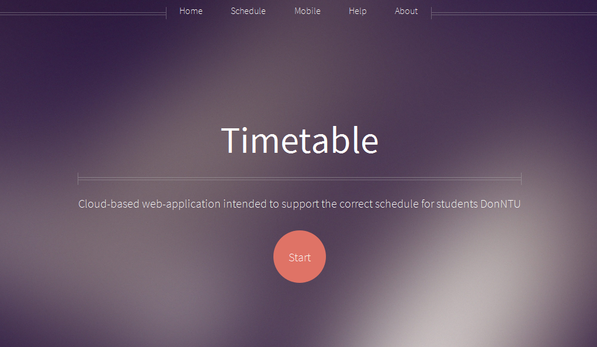

Timetable
===========

## Table of contents

* [Overview](#overview)
* [Features](#features)
* [Web GUI Interface](#web-gui-interface)
* [Cloud hostings](#cloud-hostings)
* [Usage](#usage)
* [Dependencies](#dependencies)
* [Project documents](#project-documents)
* [REST API](#rest-api)
* [References](#references)
* [Contribute](#contribute)
* [Creators](#creators)
* [License](#license)
* [More...](#more)

## Overview

Облачное веб-приложение, предназначенное для просмотра актуального расписания занятий студентов ДонНТУ.

## Features

* Приложение использует соверменный HTML5 шаблон для веб-интерфейса.
* Приложение предоставляет простой [REST API](#rest-api). Пример [приложения для Android](https://github.com/pi12/TimetableApp), использующее данное API.

## Web GUI Interface



## Cloud hostings

Данное приложение развернуто на хостингах:

* [Heroku](https://www.heroku.com/) - Cloud Application Platform as a service (PaaS).
* [Mongo Lab](https://mongolab.com/) - Fully managed MongoDB-as-a-Service.

## Usage

1. Установите интерпретатор [Python 2.7](https://www.python.org/download/releases/2.7/) и все [зависимости](#dependencies) данного проекта. (Если у вас все установлено перейдите к пункту 2)
2. Скачайте данный репозиторий на свой локальный компьютер (выполните в терминале `git clone https://github.com/pi12/timetable.git`)
3. Перейдите в корневой каталог (выполните в терминале `cd timetable`)
4. Установите переменные окружения выполнив данные команды в терминале (для Windows):

    ```
    set SERVER_NAME=localhost:5000
    set MONGODB_DB=<YOU NAME DATABASE>
    set MONGODB_USERNAME=<YOU USERNAME>
    set MONGODB_PASSWORD=<YOU PASSWORD>
    set MONGODB_HOST=<YOU HOST>
    set MONGODB_PORT=<YOU PORT>
    ```

5. Запустите приложение, выполнив команду в терминале `python run.py`
6. Откройте браузер и перейдите по адресу http://localhost:5000


## Dependencies

* Flask==0.10.1
* flask-mongoengine==0.7.1
* gunicorn==19.3.0
* Jinja2==2.8
* mongoengine==0.10.0
* and other (see requirements.txt)


## Project documents

* [Документация SRS](https://github.com/pi12/timetable/issues/4)

## REST API

Схема URI запроса: `http://donuniv.herokuapp.com/api/<METHOD_NAME>?<PARAMETERS>&v=0.1`,
**v** - обозначает версию API, которая используется.

|  METHOD_NAME           |  PARAMETERS                                                       | Описание |
|------------------------|-------------------------------------------------------------------|---------------------------------------------|
|  faculties.get         |  offset, count, order                                             |  Возвращает информацию о факультетах |
|  departments.get       |  offset, count, order, faculty_abbr\*                             |  Возвращает информацию о кафедрах |
|  lecturers.get         |  offset, count, faculty_abbr\*, department_abbr\*, order          |  Возвращает информацию о преподавателях    |
|  groups.get            |  offset, count, faculty_abbr*, order                              |  Возвращает информацию о группах |
|  faculties.search      |  query (обязательный параметр), count                             |  Метод, позволяющий найти заданный факультет, и получить о нем информацию |
|  departments.search    |  query (обязательный параметр), count                             |  Метод, позволяющий найти заданную кафедру, и получить о ней информацию |
|  groups.search         |  query (обязательный параметр), count                             |  Метод, позволяющий найти заданную группу, и получить о ней информацию |
|  lecturers.search      |  query (обязательный параметр), count                             |  Метод, позволяющий найти преподавателя и получить информацию о нем |
|  lecturer.getLessons   |  lecturer_id (обязательный параметр),  week, weekday, item_number |  Возвращает массив пар указанного преподавателя |
|  group.getLessons      |  group_abbr (обязательный параметр), week, weekday, item_number   |  Возвращает массив пар указанной группы |

\* - не реализованные параметры (в get-методах временно не реализована фильтрация)

Значения необязательных параметров по умолчанию:

* offset = 0 (если отрицательное, то ошибки не будет, будет 0)
* count = 10 (минимальное 0, максимальное 50)
* order = "random" (допустимые "random", "name")
* week = -1 (допустимые -1, 0, 1, 2)  верхняя / нижняя / обе недели
* weekday = -1 (допустимые -1, 1, 2, 3, 4, 5, 6, 7 ; 0 работает, но это ошибка, или нет :smile: ) день недели (пн, вт ...)
* item_number = -1 номер пары

**-1 в парметрах week, weekday, number можно не указывать он означает, что возвращать нужно всё**

Общий пример json-ответа:

```
{
    "response": {
    ...
    },
    "status": 0,
    "message": "OK"
}
```

### Пример использования

1. Клиент посылает HTTP GET запрос, например `http://donuniv.herokuapp.com/api/group.getLessons?group_abbr=pi12a&v=0.1`. (Чтобы узнать `group_abbr` необходимо выполнить перед этим запрос на `groups.get`)
2. Сервер возвращает ответ json-формата:

```
{
    "response": {
        "abbr": "pi12a", 
        "title": "ПИ-12а", 
        "lessons": [
            {
                "title": "Программирование", 
                "room": "4.1", 
                "lecturer": "Иванов Иван Иванович", 
                "item_number": 2, 
                "weekday_number": 1, 
                "weekday": "Monday", 
                "week_number": 2, 
                "week": "Both", 
                "description": "", 
                "subgroup": [
                    255
                ]
            }, 
            {
                "title": "Основы алгоритмов", 
                "room": "8.705", 
                "lecturer": "Петров Иван Иванович", 
                "item_number": 3, 
                "weekday_number": 1, 
                "weekday": "Monday", 
                "week_number": 2, 
                "week": "Both", 
                "description": "", 
                "subgroup": [
                    255
                ]
            }
        ]
    }, 
    "status": 0, 
    "message": "OK"
}
```

## References

* [Что такое облачные технологии?](http://hostdb.ru/articles/show/id/47)
* [Анатомия облачной инфраструктуры хранения данных](http://www.ibm.com/developerworks/ru/library/cl-cloudstorage/)
* [Что такое REST?](http://www.restapitutorial.ru/lessons/whatisrest.html#uniform-interface)
* [Архитектура REST](http://habrahabr.ru/post/38730/)
* [Знакомьтесь, архитектура REST](http://html-templates.info/blog/znakomtes-arhitektura-REST)
* Основные ссылки по Python и Flask можно найти [здесь](https://github.com/pi12/timetable/issues/3)

## Contribute

* Напишите замечание по данному проекту - https://github.com/pi12/timetable/issues/new
* Отправьте pull request - https://github.com/pi12/timetable/pulls

## Creators

* [*Artem Yegorov*](https://github.com/Yegorov) - Main developer.
* [*Gleb Kalinichenko*](https://github.com/GlebKalinichenko) - Android developer.
* [*Sergey Medgaus*](https://github.com/SergeyMedgaus) - Mentor and Database developer.
* *Igor Nikolaev* - Mentor and Database developer.

## License

Copyright 2015 by SE-12a DonNTU.

Licensed under the [Creative Commons — Attribution-NonCommercial 3.0 (CC BY-NC 3.0)](https://creativecommons.org/licenses/by-nc/3.0/deed.ru)

## More...

Вопросы и предложения вы можете задать по данному email-адресу: yegorov0725@yandex.ru

